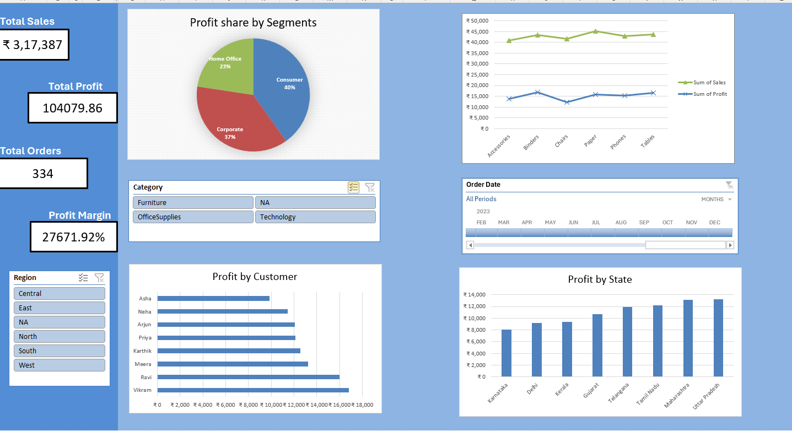
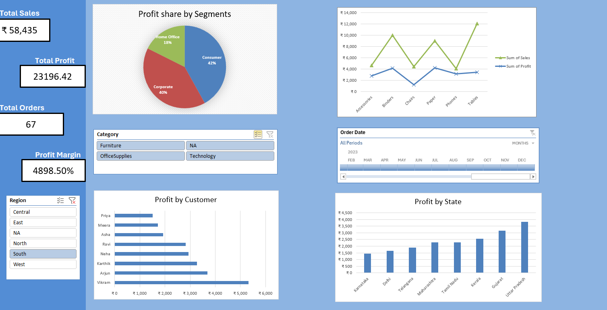

# 📊 Retail Superstore Analysis Dashboard

An interactive dashboard built to analyze $317k in sales data. This project demonstrates end-to-end data processing from raw CSV to executive-level insights.

## 🚀 Live Preview
### Main Overview

### Dynamic Regional Filtering

## 🛠️ Key Features
- **Data Cleaning:** Used Power Query to handle missing values and "NA" entries.
- **Dynamic KPIs:** Linked text boxes to Pivot Table Grand Totals for real-time updates.
- **Chronological Sorting:** Fixed the "Alphabetical Month" bug using helper columns (Jan-Dec).
- **Interactive Slicers:** Master Region Slicer connected to all charts and KPIs.

## 📈 Business Insights
- **Top Category:** Technology contributes the highest profit margin.
- **Profitability Leak:** Identified specific sub-categories with high sales but low profit.
